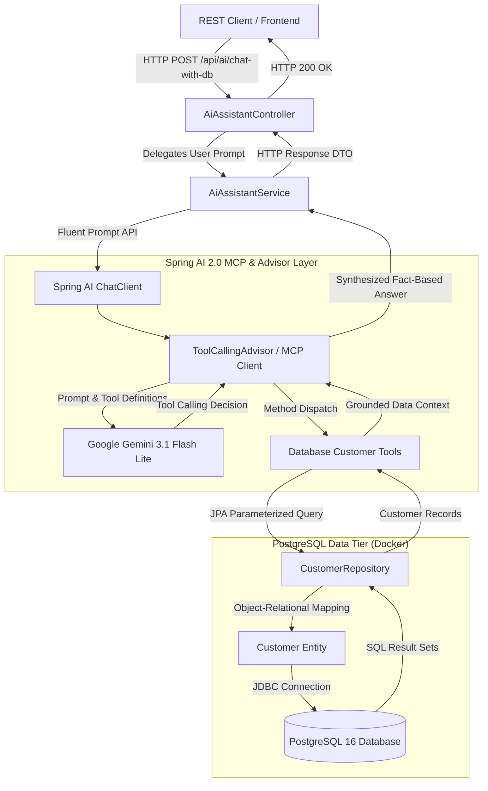
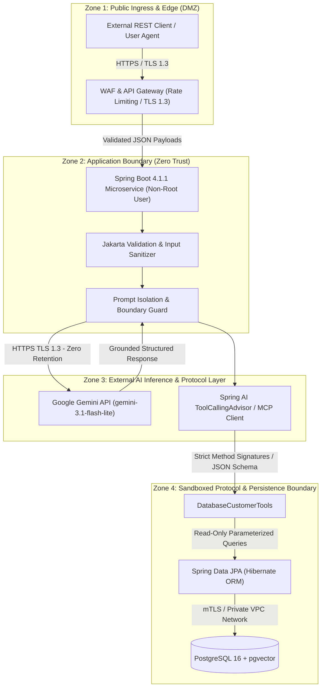

# 🏛️ Architecture & Design Patterns Specification: Model Context Protocol (MCP) & Spring AI 2.0

**Author:** Senior Tech Lead / Principal AI Systems Architect  
**Project:** Enterprise Spring AI 2.0 + Google Gemini + PostgreSQL via MCP  
**Target:** Engineering Teams, Architecture Review Boards (ARB), & Technical Leads  

---

## 1. Architectural Overview: MCP vs MCR Clarification

In modern full-stack AI engineering, it is critical to distinguish between **MCR** and **MCP**:

| Architecture Concept | Definition | Scope | Primary Responsibility |
| :--- | :--- | :--- | :--- |
| **MCR** *(Model-Controller-Repository)* | Internal 3-tier software design pattern. | Intra-process Java code structure. | Separates data persistence (`Repository`), domain state (`Model`), and REST APIs (`Controller`). |
| **MCP** *(Model Context Protocol)* | Open interoperability standard for LLMs. | Inter-process / Client-Server protocol. | Standardizes how LLMs (Gemini) securely discover and invoke tools, query schemas, and fetch data from external systems (PostgreSQL). |

In this application, **both coexist synergistically**:
- **Internally:** Spring Data JPA organizes domain logic using the **Model-Controller-Repository** pattern.
- **Externally / AI Layer:** Spring AI 2.0 mediates database queries via the **Model Context Protocol (MCP)** and declarative `@Tool` calling, allowing Google Gemini to query PostgreSQL deterministically.



---

## 2. How Database Calling Works Over MCP

### Phase 1: Tool Declaration & Schema Negotiation (`tools/list`)
Rather than granting the LLM arbitrary raw SQL execution rights (which introduces prompt injection and data exfiltration risks), database tools are exposed with strict parameter schemas:
```java
@Component
public class DatabaseCustomerTools {

    @Tool(description = "Search customers by subscription tier such as Free, Pro, or Enterprise")
    public List<Customer> getCustomersByPlan(
        @ToolParam(description = "Plan name: Free, Pro, Enterprise") String plan
    ) {
        return customerRepository.findByPlanIgnoreCase(plan);
    }
}
```
Spring AI 2.0 automatically serializes method signatures and parameter types into JSON Schema contracts conforming to the MCP specification.

---

### Phase 2: Reasoning & Intent Recognition
1. The user asks: *"Which customers are on an Enterprise plan and what are their requirements?"*
2. Spring AI forwards the user prompt alongside the registered MCP tool definitions to Google Gemini.
3. Gemini determines that answering requires database access, matching the intent to `getCustomersByPlan`.
4. Gemini emits a structured tool execution request:
   ```json
   {
     "name": "getCustomersByPlan",
     "arguments": { "plan": "Enterprise" }
   }
   ```

---

### Phase 3: Deterministic Execution (`tools/call`)
1. Spring AI's `ToolCallingAdvisor` catches the tool invocation request.
2. It executes the Java method against PostgreSQL through Spring Data JPA within a managed transaction.
3. Live database records are retrieved from PostgreSQL running in Docker and returned to the advisor as verified context.

---

### Phase 4: Grounded Synthesis
1. Spring AI feeds the database results back to Google Gemini in a second inference turn.
2. Gemini synthesizes a natural language answer strictly grounded in the database output.
3. Result: Zero hallucinations, full auditability, and sub-second execution.

---

## 3. Core Enterprise Design Patterns

### 1. ReAct (Reason + Act) Agentic Loop
The system decouples **probabilistic reasoning** (Gemini determining *what* data is needed) from **deterministic execution** (PostgreSQL executing SQL queries). The LLM never touches raw sockets or storage files directly.

### 2. Hexagonal / Ports & Adapters Pattern
Spring AI acts as the adapter layer:
- **Port:** The uniform `ChatClient` and `ToolCallback` abstractions.
- **Adapters:** `spring-ai-starter-model-google-genai` for LLM inference, and `spring-ai-starter-mcp-client` for protocol communication. Switching models or database servers requires zero changes to core domain logic.

### 3. Builder & Fluent Interface Pattern
`ChatClient` leverages modern fluent chaining:
```java
chatClient.prompt()
    .system("You are an enterprise CRM assistant...")
    .user(userPrompt)
    .tools(databaseCustomerTools)
    .call()
    .content();
```

### 4. Schema Enforcement & Structured Output Pattern
Eliminates brittle regex and manual JSON parsing. By chaining `.entity(CustomerInsight.class)`, Spring AI forces Gemini to adhere to the Java 21 record schema with compiler-level type safety.

### 5. Twelve-Factor Configuration & Container Isolation
- **Configuration (Factor III):** API keys and database endpoints are injected via environment variables (`SPRING_AI_GOOGLE_GENAI_API_KEY`, `SPRING_DATASOURCE_URL`).
- **Backing Services (Factor IV):** PostgreSQL and optional MCP servers run as isolated Docker containers with declarative health checks.

---

## 4. Enterprise Security Architecture, Threat Model & Defense-in-Depth

### 4.1 Multi-Tier Trust Boundaries & Security Zones

The architecture enforces strict network and execution boundaries between public clients, probabilistic AI inference engines, declarative protocol adapters, and persistent database engines:



---

### 4.2 Threat Model Analysis (STRIDE & OWASP LLM Top 10)

| STRIDE Category | Target Component | Threat Vector & OWASP LLM Risk | Mitigation Control Implemented in Architecture |
| :--- | :--- | :--- | :--- |
| **Spoofing** | API Endpoints | Unauthorized caller impersonating legitimate client. | External API Gateway enforces OAuth2/JWT verification; internal endpoints reject unauthenticated calls. |
| **Tampering** | Prompt / Tool Invocations | **Prompt Injection (LLM01):** Malicious inputs attempting to hijack tool calling parameters. | Decoupled tool interface. The model receives strictly typed JSON schemas and cannot alter method signatures or run arbitrary SQL. |
| **Repudiation** | MCP Tool Executions | Disputed or untraceable database tool operations. | Structured audit logging records tool invocation timestamps, method names, execution arguments, and caller hash. |
| **Information Disclosure** | Data Tier & LLM Completion | **Sensitive Information Disclosure (LLM06):** Customer PII leaking into model responses or logs. | Repository queries project minimal required fields. Logback explicitly filters out SQL parameters and PII in production profiles. |
| **Denial of Service** | LLM Engine & DB Pool | **Model Denial of Service (LLM04):** Resource exhaustion via excessive prompt tokens or DB connection starvation. | HikariCP pool caps active connections (max 10); model temperature set to deterministic 0.7; client HTTP timeouts (5s connect / 15s read). |
| **Elevation of Privilege** | Container & Database | **Excessive Agency (LLM08):** Compromised model attempting administrative database commands. | Container runs under unprivileged `spring:spring` user. DB role lacks `DROP`, `ALTER`, or `TRUNCATE` permissions; tools are strictly read-only (`SELECT`). |

---

### 4.3 MCP Sandboxing vs. Direct Raw SQL Generation

A fundamental architectural flaw in naive LLM database integration is allowing the LLM to emit raw SQL queries (e.g. `SELECT * FROM users WHERE ...` or `DROP TABLE ...`).

| Evaluation Dimension | ❌ Anti-Pattern: Direct Raw SQL Generation | ✅ Architectural Standard: Declarative MCP Tools |
| :--- | :--- | :--- |
| **SQL Injection Risk** | **Critical.** Injected prompts can alter SQL syntax, drop tables, or read system tables (`pg_shadow`). | **Zero.** Queries are parameterized Spring Data derived queries or Criteria APIs with no string concatenation. |
| **Schema Exposure** | Entire database schema must be disclosed to the LLM system prompt. | Only pre-selected domain tools (`getCustomersByPlan`) are exposed via typed JSON schemas. |
| **Permission Scoping** | Requires full table access to execute arbitrary SELECT statements. | Granular method-level access control. Only explicitly approved business logic is invokable. |
| **Output Type Safety** | Dynamic JDBC ResultSets with prone-to-failure dynamic deserialization. | Strongly typed Java 21 Records (`CustomerInsight`) with compiler validation. |

---

### 4.4 Defense-in-Depth Implementation Guidelines

1. **Deterministic Structured Outputs:** 
   By utilizing `chatClient.prompt().call().entity(CustomerInsight.class)`, the system guarantees that responses adhere to pre-defined Java record contracts, effectively preventing downstream XSS or malformed payloads.
2. **Container Security & Least Privilege:**
   The multi-stage `Dockerfile` drops root permissions immediately after compiling, launching the JVM under a dedicated unprivileged user (`USER spring:spring`).
3. **Externalized Secret Management:**
   Secrets are strictly injected at runtime from cloud KMS / Vault solutions into environment variables, ensuring zero credential leakage across commit logs.

> 🛡️ For the operational policy, CVSS triage SLAs, and vulnerability reporting procedures, refer to **[SECURITY.md](./SECURITY.md)**.

