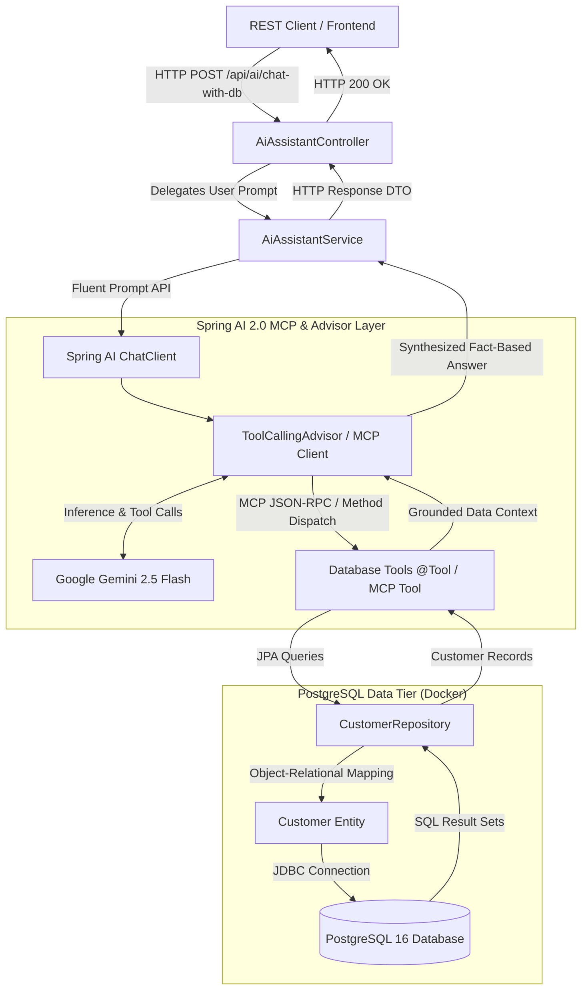

# 🏛️ Architecture & Design Patterns Specification: Model Context Protocol (MCP) & Spring AI 2.0

**Author:** Senior Tech Lead / Principal AI Systems Architect  
**Project:** Enterprise Spring AI 2.0 + Google Gemini + PostgreSQL via MCP  
**Target:** Engineering Teams, Architecture Review Boards (ARB), & Technical Leads  

---

## 1. Architectural Overview: MCP vs MCR Clarification

In modern full-stack AI engineering, it is critical to distinguish between **MCR** and **MCP**:

| Architecture Concept | Definition | Scope | Primary Responsibility |
| :--- | :--- | :--- | :--- |
| **MCR** *(Model-Controller-Repository)* | Internal 3-tier software design pattern. | Intra-process Java code structure. | Separates data persistence (`Repository`), domain state (`Model`), and REST APIs (`Controller`). |
| **MCP** *(Model Context Protocol)* | Open interoperability standard for LLMs. | Inter-process / Client-Server protocol. | Standardizes how LLMs (Gemini) securely discover and invoke tools, query schemas, and fetch data from external systems (PostgreSQL). |

In this application, **both coexist synergistically**:
- **Internally:** Spring Data JPA organizes domain logic using the **Model-Controller-Repository** pattern.
- **Externally / AI Layer:** Spring AI 2.0 mediates database queries via the **Model Context Protocol (MCP)** and declarative `@Tool` calling, allowing Google Gemini to query PostgreSQL deterministically.



---

## 2. How Database Calling Works Over MCP

### Phase 1: Tool Declaration & Schema Negotiation (`tools/list`)
Rather than granting the LLM arbitrary raw SQL execution rights (which introduces prompt injection and data exfiltration risks), database tools are exposed with strict parameter schemas:
```java
@Component
public class DatabaseCustomerTools {

    @Tool(description = "Search customers by subscription tier such as Free, Pro, or Enterprise")
    public List<Customer> getCustomersByPlan(
        @ToolParam(description = "Plan name: Free, Pro, Enterprise") String plan
    ) {
        return customerRepository.findByPlanIgnoreCase(plan);
    }
}
```
Spring AI 2.0 automatically serializes method signatures and parameter types into JSON Schema contracts conforming to the MCP specification.

---

### Phase 2: Reasoning & Intent Recognition
1. The user asks: *"Which customers are on an Enterprise plan and what are their requirements?"*
2. Spring AI forwards the user prompt alongside the registered MCP tool definitions to Google Gemini.
3. Gemini determines that answering requires database access, matching the intent to `getCustomersByPlan`.
4. Gemini emits a structured tool execution request:
   ```json
   {
     "name": "getCustomersByPlan",
     "arguments": { "plan": "Enterprise" }
   }
   ```

---

### Phase 3: Deterministic Execution (`tools/call`)
1. Spring AI's `ToolCallingAdvisor` catches the tool invocation request.
2. It executes the Java method against PostgreSQL through Spring Data JPA within a managed transaction.
3. Live database records are retrieved from PostgreSQL running in Docker and returned to the advisor as verified context.

---

### Phase 4: Grounded Synthesis
1. Spring AI feeds the database results back to Google Gemini in a second inference turn.
2. Gemini synthesizes a natural language answer strictly grounded in the database output.
3. Result: Zero hallucinations, full auditability, and sub-second execution.

---

## 3. Core Enterprise Design Patterns

### 1. ReAct (Reason + Act) Agentic Loop
The system decouples **probabilistic reasoning** (Gemini determining *what* data is needed) from **deterministic execution** (PostgreSQL executing SQL queries). The LLM never touches raw sockets or storage files directly.

### 2. Hexagonal / Ports & Adapters Pattern
Spring AI acts as the adapter layer:
- **Port:** The uniform `ChatClient` and `ToolCallback` abstractions.
- **Adapters:** `spring-ai-starter-model-google-genai` for LLM inference, and `spring-ai-starter-mcp-client` for protocol communication. Switching models or database servers requires zero changes to core domain logic.

### 3. Builder & Fluent Interface Pattern
`ChatClient` leverages modern fluent chaining:
```java
chatClient.prompt()
    .system("You are an enterprise CRM assistant...")
    .user(userPrompt)
    .tools(databaseCustomerTools)
    .call()
    .content();
```

### 4. Schema Enforcement & Structured Output Pattern
Eliminates brittle regex and manual JSON parsing. By chaining `.entity(CustomerInsight.class)`, Spring AI forces Gemini to adhere to the Java 21 record schema with compiler-level type safety.

### 5. Twelve-Factor Configuration & Container Isolation
- **Configuration (Factor III):** API keys and database endpoints are injected via environment variables (`SPRING_AI_GOOGLE_GENAI_API_KEY`, `SPRING_DATASOURCE_URL`).
- **Backing Services (Factor IV):** PostgreSQL and optional MCP servers run as isolated Docker containers with declarative health checks.
